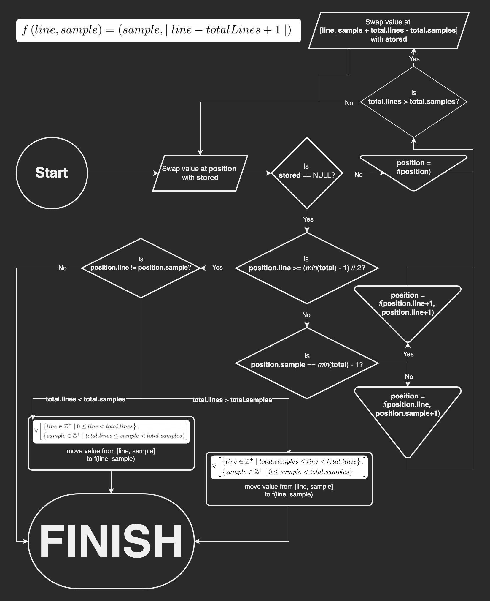

# Rotatable Grid Vector 
A class derived from `std::vector<std::vector<T>>` that provides a method to rotate the contents of the vector 90º in `O(n)` time.

---

The constructor checks that the internal vectors are all the same length (within a margin of error) in `O(1)` time by:
- Calculating `diff_fronts`: the difference between the `front` pointer of the first and second internal vectors
- Calculating `diff_empty`: the difference between the `back` and `first` pointers of the first and second internal vectors, respectively. This is necessary because compilers often round up the allocated space of vectors (this is also the cause for the margin of error).
- Asserting that the difference between the `back` and `front` pointers of the last and first internal vectors, respectively, is equal to `diff_fronts * (external_vector.size() - 1) + diff_empty`.

If the size of the external vector is 2, the sizes of the internal vectors are compared manually (using the `vector.size` method).

---

A diagram explaining the algorithm to rotate the vector can be found below.

Diagrams created using [diagrams.net](https://diagrams.net)