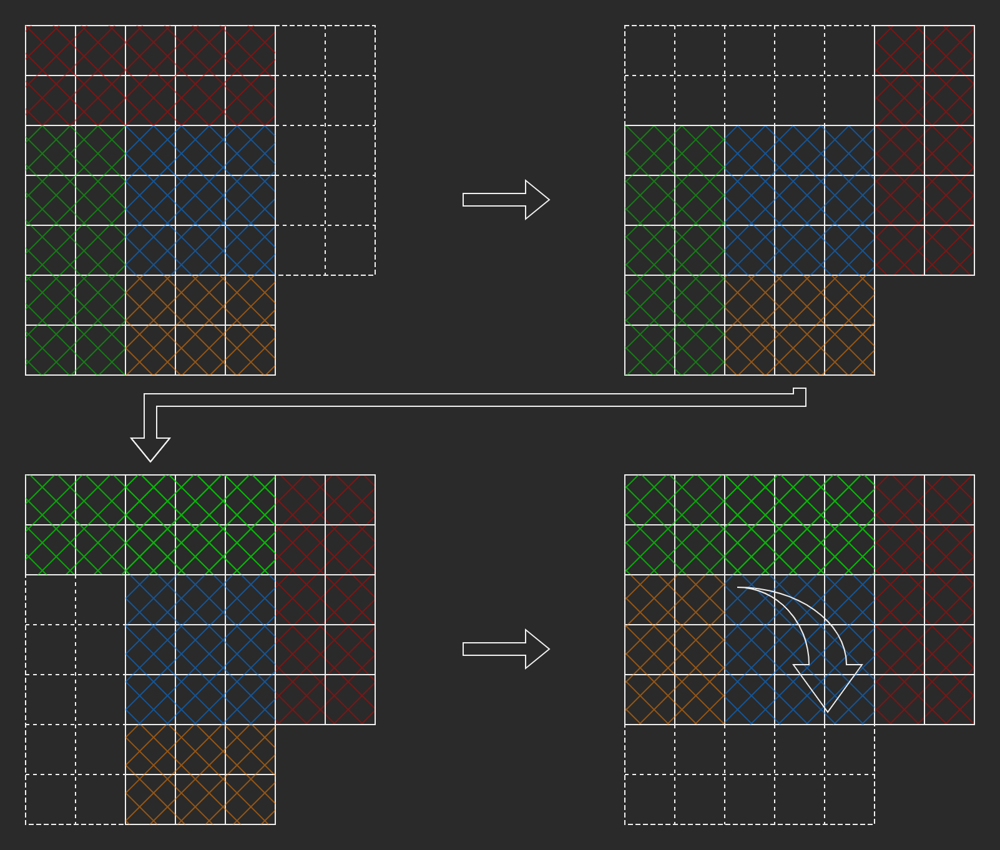

# Rotatable Grid Vector 
A class derived from `std::vector<std::vector<T>>` that provides a method to rotate the contents of the vector 90º in `O(n)` time.

---

A diagram explaining the algorithm to rotate the vector can be found below. In cases where `total.rows > total.cols` and `total.cols > (total.rows+1)/2`, a separate algorithm moves chunks of data around before the main rotation algorithm is used to avoid overwriting data in overlapping sections. The second diagram illustrates this process (dashed lines indicate empty cells). After the chunks are moved, the blue square is rotated.

Diagrams created using [diagrams.net](https://diagrams.net)