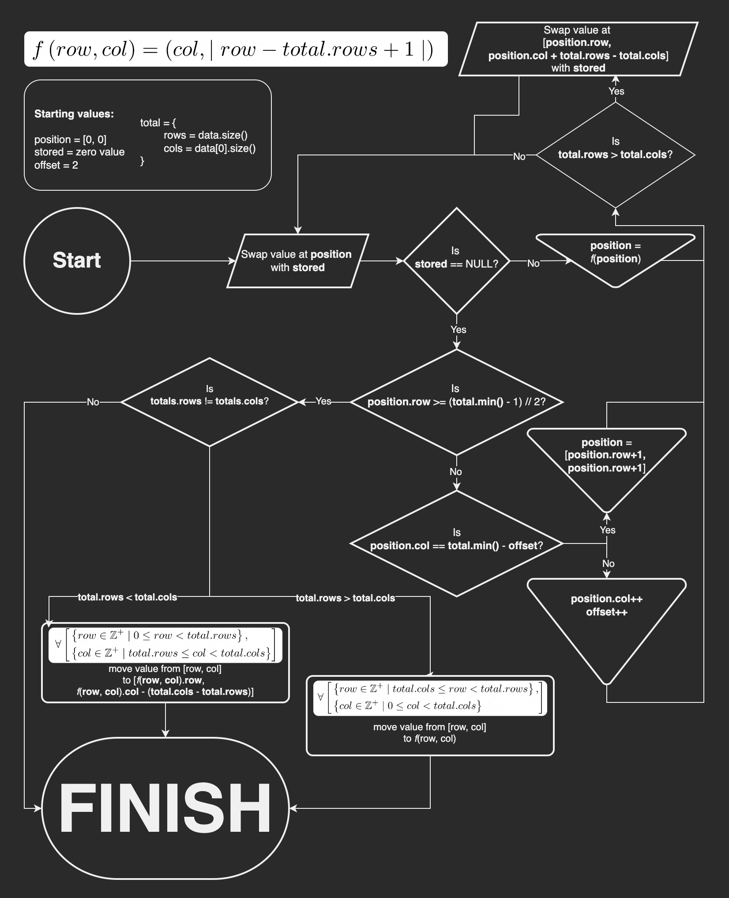

# Rotatable Grid Vector 
A class derived from `std::vector<std::vector<T>>` that provides a method to rotate the contents of the vector 90º in `O(n)` time.

---

A diagram explaining the algorithm to rotate the vector can be found below.

Diagrams created using [diagrams.net](https://diagrams.net)